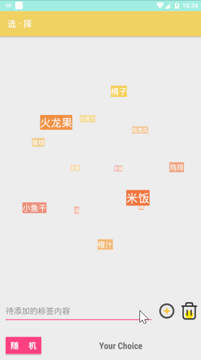

# Android - 随机选择器

有的时候，我们经常面临“吃什么”这样类似的选择难题...😂

而有一个3D球形标签云的开源库的效果还是挺好看的（在我的[smsAPP](https://github.com/NJU-TJL/smsAPP-Android)这个项目中也曾使用过），所以，这次利用这个开源库，做了一个用于随机选择的Android APP，借此可以方便的对一些选项进行随机选择...

**下载地址：**

**效果：**（在模拟器中运行）

（如果图片加载失败，可在博客中查看：）

**使用：**

1. 输入“待添加的标签内容”后，点击左侧的加号按钮，即可加入新标签
2. 左侧的“清空”按钮，用于清空所有标签
3. 点击上方的某个标签，可以删除此标签
4. 下方的红色的“随机”按钮，用于随机在这些标签中随机选出一个

**其他：**

+ 为什么这个色调？因为...据说红黄色有助于食欲~

+ 如何使用这个开源库，可以见于我的博客：

+ 附上开源库的原始地址：

